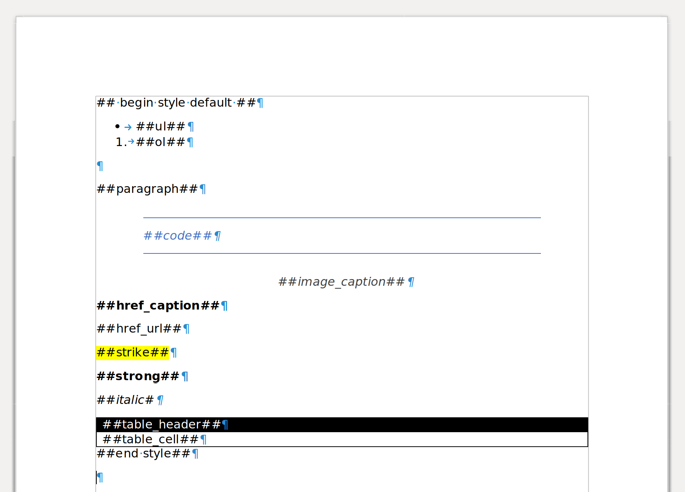

# **Filters**

## Convert Timestamp to Human Readable Date

**`{{key_in_json_data|timestamp}}`**  
**`{{key_in_json_data|timestamp('__date_format__')}}`**

Converts a timestamp in milliseconds as entry and convert it to a human readable date.

It takes as parameter `__date_format__` which corresponds to a strftime-like date format (see [this link](https://strftime.org/))  
Default value is `'%d/%m/%Y'`

## Add Markdown

**`{{p key_in_json_data|markdown }}`**  
**`{{p key_in_json_data|markdown('__style_name__') }}`**

Interpretes the markdown and add it to the final .docx document with the proper styling.

The `mardown` filter takes as parameter `__style_name__` which refers to a _style_ declared in the .docx template.  
The default value of the parameter `__style_name__` is `default`.  
This _style_ depicts which .docx sub style must be applied to a bold Mardown tag for example.

To declare a _style_, the following lines must be added to the template :

```text
    ##BEGIN STYLE style_name##
    ...
    ##sub style x##
    ...
    ##END STYLE##
```

We will see in the next part how to declare each sub style properly.

### Declaring sub styles

The sub style tags listed underneath are used to associate .docx formatting to a Markdown tag.  
Adding one of them to the style block in the template and applying formatting on it will reflect on the final result in the generated document.  



#### Paragraph sub styles

Define the way a paragraph is rendered in the .docx result.

| Title             | Sub Style Tag         |
| ----------------- | --------------------- |
| Paragraph         | `##paragraph##`       |
| Unordered List    | `##ul##`              |
| Ordered List      | `##ol##`              |
| Code Block        | `##code##`            |
| Quote             | `##quote##`           |
| Image Caption     | `##image_caption##`   |

#### Text sub styles

Define the way standard text is rendered in the .docx result.

| Title             | Sub Style Tag         |
| ----------------- | --------------------- |
| Bold              | `##strong##`          |
| Italic            | `##italic##`          |
| Strikethrough     | `##strike##`          |
| Inline Code       | `##inline_code##`     |
| Link              | `##hyperlink##`       |

### Notes

* Line Break & Paragraphs

Add `\n` for new line.  
Add `\n\n` for ne paragraph.

## Other filters

Default Jinja2 filters are also available.  
You can find theme [here](https://jinja.palletsprojects.com/en/2.11.x/templates/#list-of-builtin-filters)
