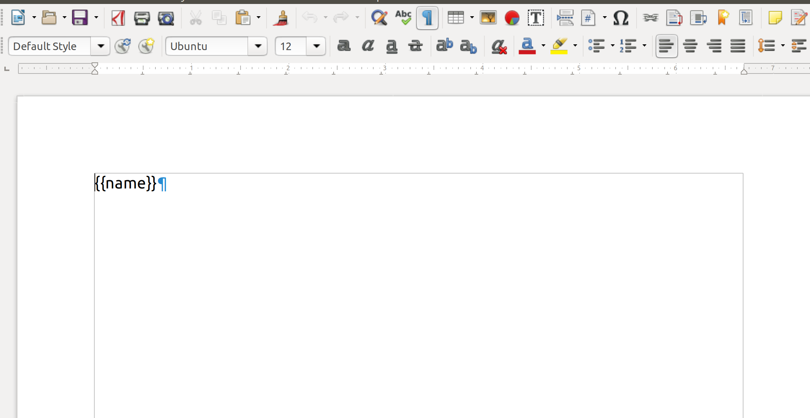
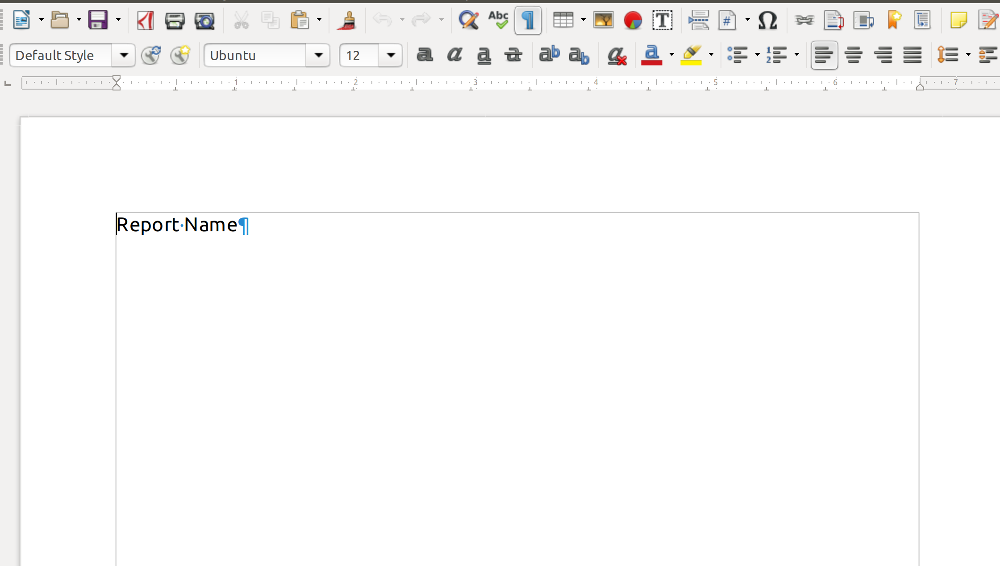

# DocxGenerator

Welcome to **DocxGenerator** documentation

## Introduction  

This package has been created to ease the generation of .docx document from .docx templates and JSON formatted data.

It is based on the **[python-docx-template](https://docxtpl.readthedocs.io/en/latest/)** package.
The main idea behind this is create a .docx template file using Jinja2-like tags where you want to add non static data.

The aime is to improve **python-docx-template** package by adding, for example, FTP file storage support or new Jinja2 filters and globals.

## Quickstart

* **Install**

The package is not directly accessible from `pip`, you must get the package `.whl`

``` bash
    pip install <package_name>.whl
```

* **Basic Usage**

``` python
    from docx_generator import DocxGenerator

    generator = DocxGenerator()

    data = {
        'project_name': 'My Project'
    }

    generator.generate_docx_from_local_template('base/path', 'relative/path/to/template.docx', data, 'relative/path/for/output.docx')
```

Template and output paths must be relative to base path
The .docx template file is a regular .docx file with Jinja2 tags.  
Data are taken from the JSON passed as parameter and added into the file.

JSON data:

```json
{
    "name": "Report Name"
}
```

Template:



Result:



To manipulate those data, it is possible to use [filters](filters.md) or [global functions](globals.md)  
It is also possible to add logic inside the template to loop other a list or to conditionally render an element for example. See the documentation of [python-docx-template](https://docxtpl.readthedocs.io/en/latest/) and [Jinja2](https://jinja.palletsprojects.com/en/2.11.x/) for more information about that.

The template is rendered **recursively** as long as Jinja2-like tags are found into it.  
The same JSON of data is used for every render process.  
The maximum rendering depth is **5**.  
This means that it is possible to have a JSON of data like follow:

```json
{
    "first_render_key": "lorem ipsum {{second_render_key}}",
    "second_render_key": "some stuff"
}
```

## Possible Enhancements

* **Remove style definitions**  

A good addition would be to remove the style definition blocks at the end of a document generation.  
It could be stated, for example, that each style definition should be put on an independent page so that we could delete that page at the end of the document generation.
